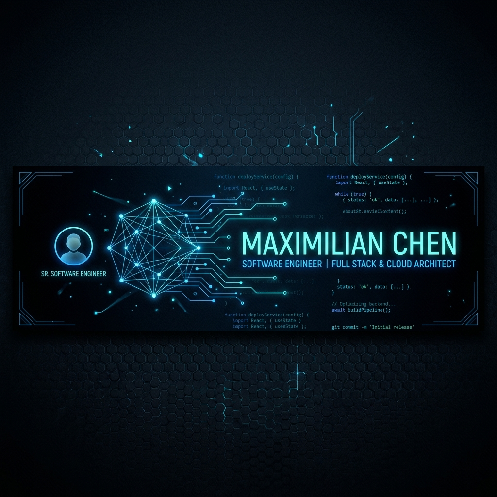
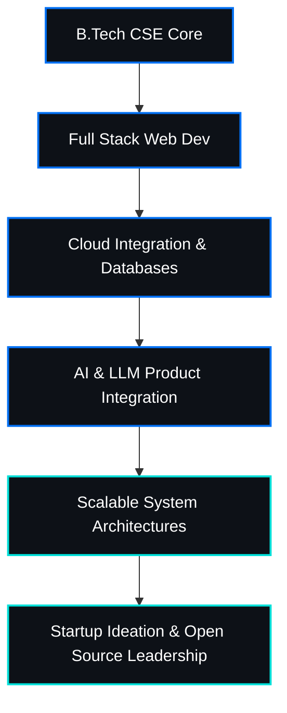

<!-- Hero Banner -->

 
 

<!-- Visitor Counter & Social Badges -->

 

<!-- Typing SVG Intro -->

  <strong>Building impactful products at the intersection of Software Engineering, Artificial Intelligence, and Product Design.</strong>

---

## ⚡ About Me & Personal Branding

I am a **Computer Science & Engineering Student** based in India, driven by a passion for creating software products that solve real-world problems. My interest lies at the convergence of full-stack development, artificial intelligence, product architecture, and tech entrepreneurship. I thrive on translating abstract ideas into highly responsive, scalable, and beautifully designed user experiences.

- 🚀 **Current Focus:** Deepening knowledge in Full Stack Development, AI integration, and Scalable Architectures.
- 💡 **Philosophy:** Build with purpose, design for the user, and optimize for performance.
- 🎓 **Education:** B.Tech in Computer Science & Engineering.
- ⚙️ **Strengths:** Rapid prototyping, problem-solving with Data Structures & Algorithms, and product-focused engineering.

---

## 🏆 GitHub Trophies

  

---

## 📊 GitHub Analytics

<table border="0" cellpadding="5" cellspacing="5" width="100%">
  <tr>
    <td align="center" width="50%" valign="top">
      
    </td>
    <td align="center" width="50%" valign="top">
      
    </td>
  </tr>
  <tr>
    <td align="center" colspan="2" width="100%" valign="top">
      
    </td>
  </tr>
</table>

---

## 📈 Activity Graph

  

---

## 🛠️ Tech Stack & Skills

<strong>💻 Programming Languages</strong>

 

  
  
  
  

<strong>🎨 Frontend Development</strong>

 

  
  
  
  
  

<strong>⚙️ Backend & Databases</strong>

 

  
  
  

<strong>🔧 Developer Tools & Environments</strong>

 

  
  
  
  

<strong>📚 Core Computer Science</strong>

 

  
  
  
  
  

---

## 📁 Featured Projects

Here are some of the key products I have designed and developed:

### 🎮 PlaySphere AI
> **AI-Powered Sports Venue Discovery & Smart Booking Platform**
> 
> An intelligent web application that connects sports enthusiasts with venue owners, offering smart match recommendations and smooth scheduling.
>
> 📂 **Repository:** [PlaySphere-AI](https://github.com/devvikax/PlaySphere-AI) | 💻 **Live Demo:** [View App](https://github.com/devvikax/PlaySphere-AI)

* **Key Capabilities:**
  * 🧠 **AI Venue Recommender:** Suggests the best venues based on user preferences, location, and past activities.
  * 🗺️ **Interactive Maps:** Real-time visual exploration of nearby arenas and turf fields.
  * ⚡ **Smart Booking System:** Seamless scheduling, booking management, and instant notifications.
  * 📊 **Double Dashboards:** Tailored interfaces for system admins and venue owners to manage listings and track analytics.
* **Tech Stack:**
  * 
  * 
  * 
  * 
  * 
  * 
  * 

---

### 🌱 Green Hero
> **Carbon Footprint Tracking & Sustainability Platform**
> 
> A gamified green-living application that empowers individuals to calculate, track, and reduce their carbon footprint through daily habits.
>
> 📂 **Repository:** [Green-Hero](https://github.com/devvikax/Green-Hero) | 💻 **Live Demo:** [View App](https://github.com/devvikax/Green-Hero)

* **Key Capabilities:**
  * 📉 **Carbon Calculator:** Comprehensive tracking of daily commute, diet, energy consumption, and recycling habits.
  * 🤖 **AI Eco-Coach:** Context-aware personalized feedback and recommendations for reducing emissions.
  * 🏆 **Sustainability Challenges:** Interactive daily and weekly eco-challenges with progress milestones.
  * 📈 **Analytics & Insights:** Visually appealing charts showing progress over time.
* **Tech Stack:**
  * 
  * 
  * 
  * 

---

### 🔥 StudyStreak
> **Learning Consistency & Habit Tracking Platform**
> 
> A client-side developer dashboard designed to instill learning habits, manage milestones, and track consistency visually.
>
> 📂 **Repository:** [StudyStreak](https://github.com/devvikax/StudyStreak) | 💻 **Live Demo:** [View App](https://github.com/devvikax/StudyStreak)

* **Key Capabilities:**
  * 📅 **Daily Streak Engine:** Records daily learning habits with custom reminders and streaks.
  * 🗺️ **Contribution Heatmap:** GitHub-inspired activity grid displaying daily consistency.
  * 🎯 **Goal Management:** Intuitive dashboard for setting short-term and long-term milestones.
  * 💾 **Local Storage Persistence:** Zero-backend setup keeping user data completely localized and private.
* **Tech Stack:**
  * 
  * 
  * 
  * 

---

## 💻 Competitive Programming & Coding Profiles

To sharpen my problem-solving abilities and algorithmic thinking, I regularly solve challenges across platforms:

- 💻 **LeetCode:** [devvikax](https://leetcode.com/u/devvikax/) – DSA practices and patterns.
- 🏆 **HackerRank:** [devvikax](https://www.hackerrank.com/profile/devvikax) – Algorithmic milestones and skill verifications.
- 🧪 **GeeksforGeeks:** [devvikax](https://www.geeksforgeeks.org/user/devvikax/) – Concept reviews and database query practices.

 

  
  
  

---

## 🗺️ Learning Journey & Future Aspirations

### 🎯 Current Milestones
* 🧬 Designing and deploying microservices architectures.
* 🤖 Fine-tuning AI integrations using Gemini API and AI Studio.
* 📦 Actively seeking open-source projects to contribute to.

### 🌐 Open Source Interests
I am strongly committed to the open-source philosophy. I am looking to contribute to modern JavaScript/TypeScript web ecosystems, Firebase integrations, and AI orchestration frameworks. If you are a maintainer looking for help, feel free to reach out!

---

## 🤝 Connect & Collaborate

I'm always open to discussing new projects, internships, hackathons, open-source collaborations, or software development roles. Let's build something extraordinary!

| Platform | Handle/Link |
| :--- | :--- |
| **LinkedIn** | [linkedin.com/in/devvikax](https://linkedin.com/in/devvikax) |
| **X / Twitter** | [@devvikax](https://twitter.com/devvikax) |
| **Portfolio** | [devvikax.github.io](https://devvikax.github.io) |
| **Email** | [devvikax@gmail.com](mailto:devvikax@gmail.com) |

 

  
   
  <i>"The best way to predict the future is to invent it." — Alan Kay</i>

